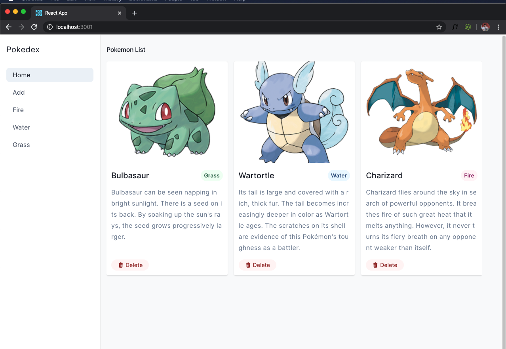
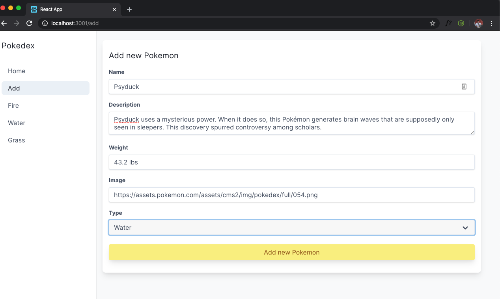
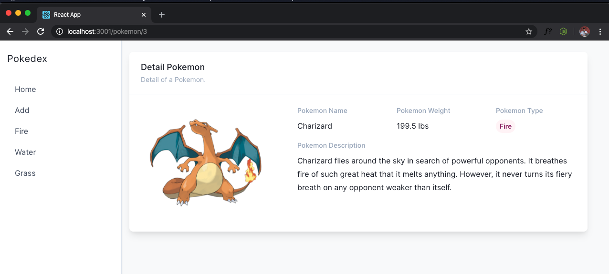
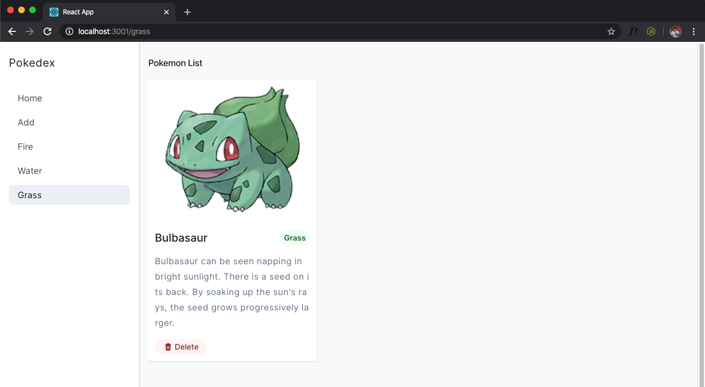
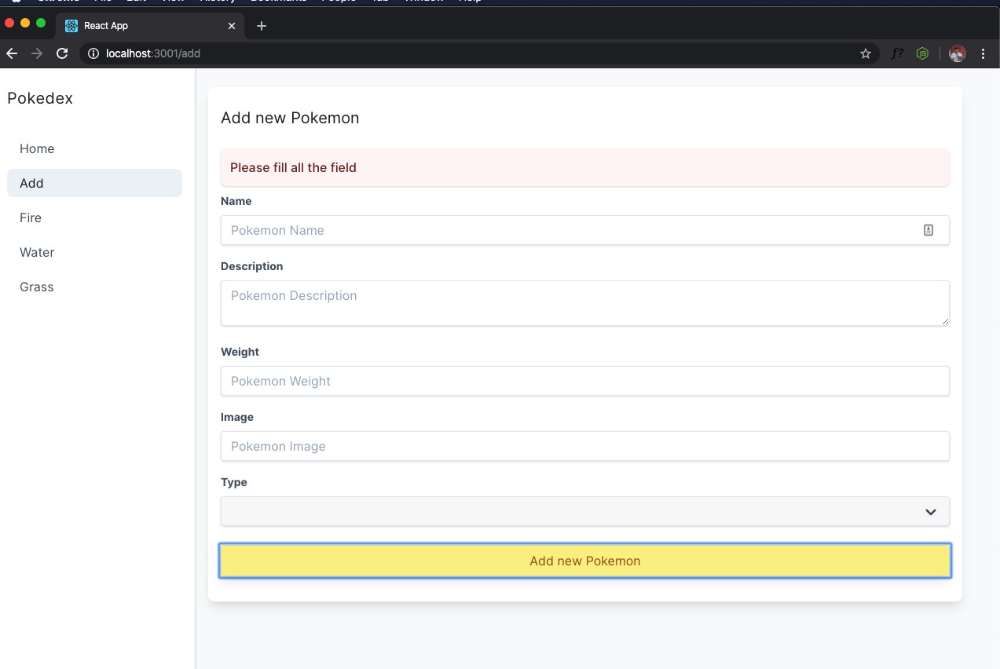

# Pokedex

> ⏰ Time limit: **150 min**

## Summary

Pada tugas kali ini kalian akan membuat sebuah aplikasi bernama `Pokedex`. Dalam aplikasi ini kalian akan menampilkan berbagai macam `Pokemon`. Kalian juga dapat menambhakan `Pokemon` baru ke dalam list kalian. Silahkan menggunakan `json-server` sebagai database pada aplikasi ini.

Skema dari aplikasi ini adalah sebagai berikut:

```JSON
{
  "pokemon": [
    {
      "id": 1,
      "name": "Bulbasaur",
      "type": "grass",
      "description": "Bulbasaur can be seen napping in bright sunlight. There is a seed on its back. By soaking up the sun's rays, the seed grows progressively larger.",
      "weight": "15.2 lbs",
      "image": "https://assets.pokemon.com/assets/cms2/img/pokedex/detail/001.png"
    }
  ]
}
```

> Kalian dibebaskan untuk membuat design dari aplikasi ini selama fitur yang kita minta terpenuhi 😉

> Perhatikan juga penempatan element pada aplikasi kalian sehingga nyaman untuk dilihat oleh user 😉

## Competencies

- React
- React Router
- Redux
- Reusable Component

## Release 0

Buatlah sebuah halaman pada path `/` yang akan menampilkan kumpulan `Pokemon` yang tersedia.

Pada setiap item nya akan terdapat data:

- Gambar dari `Pokemon` tersebut.
- Nama dari `Pokemon` tersebut.
- Type dari `Pokemon` tersebut.
- Deskripsi dari `Pokemon` tersebut.



**Rules**

- Data dari `Pokemon` wajib didapatkan dari `redux`.
- Fetch data `Pokemon` dari database harus melalui `action` di redux.

## Release 1

Buatlah sebuah form yang akan menambahkan `Pokemon` baru kedalam database kita. Kalian dapat membuat halaman baru / membuat modal untuk form ini.

Data yang dapat di input untuk `Pokemon` baru kita adalah `nama pokemon`, `deskripsi pokemon`, `berat pokemon`, `gambar pokemon` dan `type pokemon` yang merupakan select box dengan pilihan input `Fire`, `Water` dan `Grass`. Gunakanlah textarea untuk menyimpan deskripsi dari `Pokemon` yang akan kalian buat.

Jika kalian menggunakan halaman baru pastikan user kembali ke halaman `/` ketika berhasil menyimpan data `Pokemon`.

Pastikan `Pokemon` yang baru kalian buat sudah terlihat pada list di halaman `/`

Kalian bisa menggunakan [Website ini](https://www.pokemon.com/us/pokedex) Sebagai referensi Pokemon yang kalian masukkan.



**Rules**

- Menyimpan data `Pokemon` ke database harus melalui `action` di redux.

## Release 2

Lakukanlah sebuah action ketika user menekan sebuah item yang berada di halaman utama. Action yang akan dilakukan adalah mengarahkan user ke halaman `/pokemon/:id` yang menampilkan detail dari `Pokemon` yang dipilih oleh user.

**Notes**

- Kalian diperbolehkan membuat sebuah button untuk melakukan action ini.

Data yang ditampilkan pada halaman `/pokemon/:id` adalah:

- Gambar dari `Pokemon` tersebut.
- Nama dari `Pokemon` tersebut.
- Type dari `Pokemon` tersebut.
- Berat dari `Pokemon` tersebut.
- Deskripsi dari `Pokemon` tersebut.



**Rules**

- Data dari detail `Pokemon` wajib didapatkan dari `redux`.
- Fetch detail `Pokemon` dari database harus melalui `action` di redux.

## Release 3

Implementasikan button `delete` pada setiap item di halaman `/` yang akan menghapus data `Pokemon` tersebut pada database,

**Rules**

- Aksi `Delete` harus melalui `action` di redux.
- Data yang berhasil dihapus tidak ditampilkan lagi pada kumpulan `Pokemon` di halaman `/`

## Release 4

Buatlah halaman dengan path `/fire`, `/water`. `/grass` untuk menampilkan `Pokemon` yang memiliki type sesuai dengan path yang diminta.



> Menurut kalian berapa route yang kalian butuhkan untuk menyelesaikan release ini?

**Rules**

- Data dari `Pokemon` per type wajib didapatkan dari `redux`

## Release 5

Buatlah sebuah validasi ketika membuat pokemon baru dengan rules:

- Semua input harus terisi sebelum menyimpan data ke database.
- Tampilkan sebuah feedback ketika ada data yang belum terisi pada form, feedback ini dapat berbentuk modal/alert tetapi tidak diperbolehkan menggunakan fungsi `alert()` javascript.


